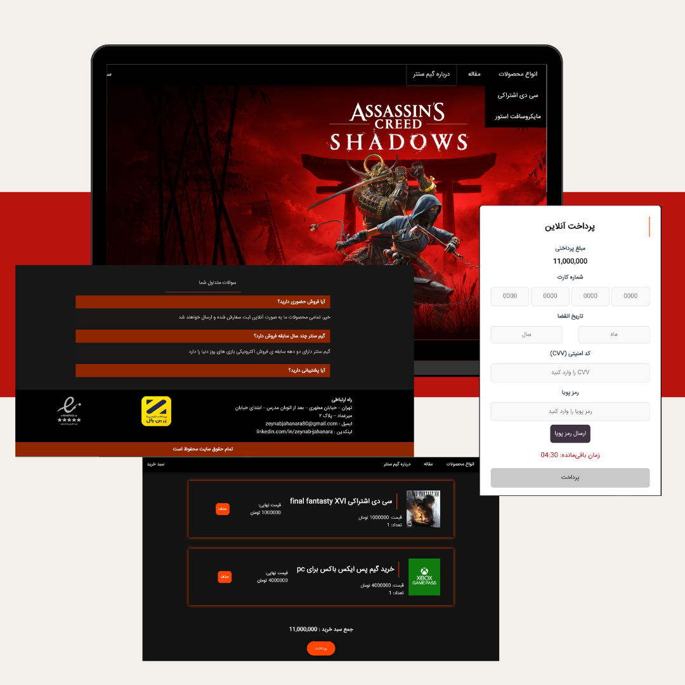

Game Center
<p>
  
</p>


**Language:** PHP  
**Database:** phpMyAdmin  

---

## Features
- Display products from the database  
- Add products to the shopping cart  
- Full MySQL integration  
- Payment gateway connection
- responsive
- calculate total of price * quantity of price

---

This project was created **for educational purposes only.**

---

## Author
**Zeynab Jahanara**  
📧 [zeynabjahanara80@gmail.com](mailto:zeynabjahanara80@gmail.com)

## How to Run
1. Copy the project folder into the `htdocs` directory (for XAMPP) or `www` directory (for WAMP).  
2. Open **phpMyAdmin** in your browser.  
3. Create a new database (`game_db`).  
4. Import the SQL file in db folder and located in the `/database/` folder into this database.  
5. Open your PHP project configuration file (e.g., `config.php`) and update the database connection settings:
   
```php
$servername = "localhost";
$username = "root";
$password = "";
$dbname = "game_db";

